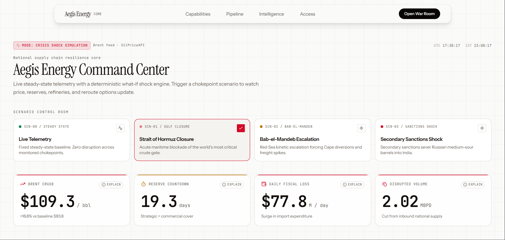
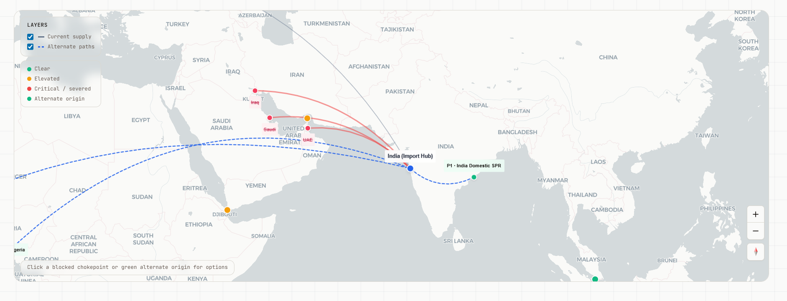
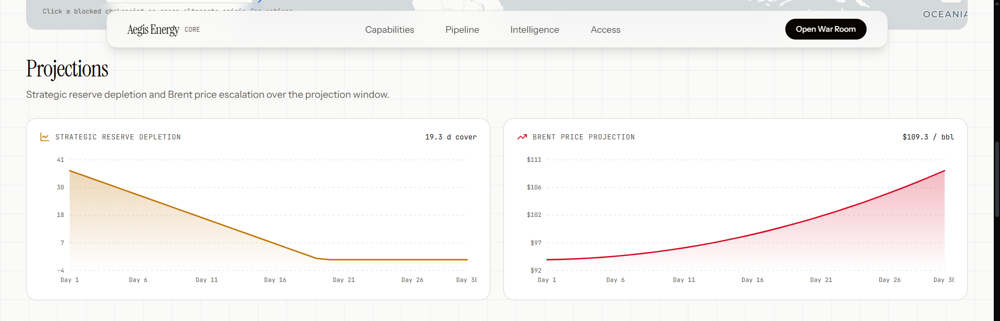
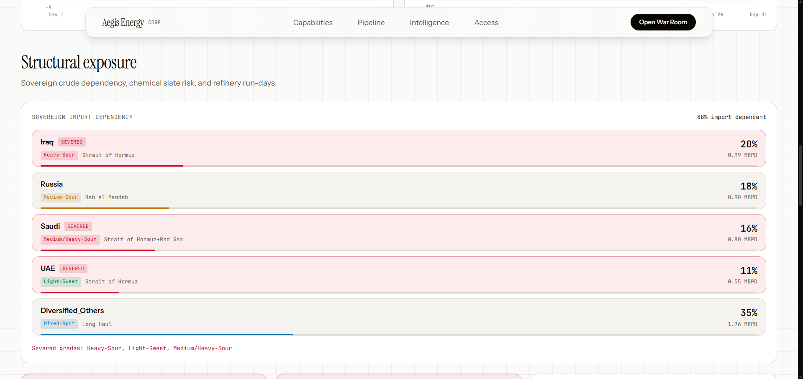

# Aegis Energy CORE

India energy-security command center. Live situational awareness, deterministic what-if shocks, and procurement guidance through a unidirectional 3-agent pipeline.

| Layer | Stack |
|-------|--------|
| **Frontend** | Next.js 15 · React 19 · Tailwind · GSAP · MapLibre |
| **Backend** | FastAPI · OpenRouter LLM · OilPriceAPI / yfinance |
| **Deploy** | Frontend → **Vercel** · Backend → **Render** |

---

## Screenshots

### Command Center — scenario shocks & impact metrics



### Supply map — chokepoints, routes & alternate origins



### Projections — reserve depletion & Brent path



### Structural exposure — sovereign import dependency



**Pitch deck (HTML):** open [`frontend/public/pitch-deck.html`](frontend/public/pitch-deck.html) locally, or visit `/pitch-deck.html` when the frontend is running.

---

## What it does

1. **Agent 1** — news ingest + OpenRouter LLM → route risk parse (falls back to `scenarios.json` in `SIMULATION`)
2. **Agent 2** — live Brent (`P_live`) + refinery exposure math + LaTeX `calculation_trace`
3. **Agent 3** — procurement memo + ranked actions (scenario-aware mock fallback)

**UI surfaces**

- Landing page — brand / product story
- `/dashboard` — War Room: metrics ribbon, live Brent, map, scenario shocks, KaTeX audit modal

---

## Repository layout

```
Energy-Security-ET/
├── backend/                 # FastAPI API
│   ├── app/                 # agents, services, schemas
│   ├── data/scenarios.json  # SIMULATION safety net
│   ├── Dockerfile           # optional Docker deploy
│   └── requirements.txt
├── frontend/                # Next.js app
│   ├── public/              # static assets + README screenshots
│   ├── src/
│   └── vercel.json
├── render.yaml              # optional Render Blueprint
├── .env.example             # env contract (copy → .env)
└── README.md
```

---

## Prerequisites

- **Git**
- **Node.js 18+**
- **Python 3.11 or 3.12**

Not in the repo (create locally):

| Path | Why |
|------|-----|
| `.env` | Secrets — gitignored |
| `backend/venv/` | Python virtualenv |
| `frontend/node_modules/` | npm dependencies |

---

## Local setup

### 1. Clone

```powershell
git clone https://github.com/AbhinavCoder-14/Energy-Security.git
cd Energy-Security
```

### 2. Environment

```powershell
copy .env.example .env
```

**SIMULATION** (demo — no live API keys required):

```env
APP_MODE=SIMULATION
AEGIS_SSL_VERIFY=0
```

**LIVE** (production pipeline — keys required):

```env
APP_MODE=LIVE
PORT=8000
ENVIRONMENT=production

OPEN_ROUTER_API=sk-or-v1-...
LLM_MODEL=google/gemini-2.5-flash
NEWSDATA_API_KEY=pub_...
OILPRICE_API_KEY=...              # optional; yfinance fallback if missing

INDIA_ISPRL_CAPACITY_MB=39.0
INDIA_COMMERCIAL_BUFFER_MB=322.5
INDIA_TOTAL_DAILY_IMPORT_MBPD=5.0
GLOBAL_DAILY_OIL_SUPPLY_MBPD=102.5
AEGIS_SSL_VERIFY=0
```

Legacy: `AEGIS_DEMO_MODE=1` maps to `APP_MODE=SIMULATION`.

### 3. Backend (port 8000)

```powershell
cd backend
python -m venv venv
.\venv\Scripts\Activate.ps1
# If blocked: Set-ExecutionPolicy -Scope CurrentUser RemoteSigned

pip install -r requirements.txt
$env:PYTHONPATH = "."
python -m uvicorn app.main:app --host 0.0.0.0 --port 8000 --reload
```

**Verify**

- Docs: http://127.0.0.1:8000/docs
- Health: http://127.0.0.1:8000/api/health
- Telemetry: http://127.0.0.1:8000/api/telemetry/live

### 4. Frontend (port 3000)

New terminal:

```powershell
cd frontend
npm install
npm run dev
```

Open http://localhost:3000 — War Room at http://localhost:3000/dashboard

Default API origin: `http://localhost:8000` (override with `NEXT_PUBLIC_API_BASE`).

### Quick start (returning)

```powershell
# Terminal 1
cd backend
.\venv\Scripts\Activate.ps1
$env:PYTHONPATH = "."
python -m uvicorn app.main:app --host 0.0.0.0 --port 8000 --reload

# Terminal 2
cd frontend
npm run dev
```

---

## API reference

| Endpoint | Purpose |
|----------|---------|
| `GET /api/health` | Mode, Brent status, key configuration flags |
| `GET /api/scenarios` | Scenario catalog |
| `GET /api/telemetry/live` | Steady-state live dashboard payload |
| `GET /api/simulate/{id}` | Full pipeline (legacy unified payload) |
| `POST /api/simulate/{id}` | Deterministic what-if → `DashboardPayload` |
| `GET /api/simulate/{id}/stream` | SSE: ingest → risk → market → impact → orchestration |

Pass `?mock=true` to force the SIMULATION path.

**Scenario IDs:** `baseline_peace` · `strait_of_hormuz_closure` · `bab_el_mandeb_escalation` · (and others in catalog)

---

## Environment variables

Create `.env` in the **project root**. Full template: [`.env.example`](.env.example).

| Variable | Purpose |
|----------|---------|
| `APP_MODE` | `LIVE` or `SIMULATION` |
| `OPEN_ROUTER_API` | OpenRouter key (or `OPENROUTER_API_KEY`) |
| `LLM_MODEL` | Model slug (default `google/gemini-2.5-flash`) |
| `NEWSDATA_API_KEY` / `NEWSAPI_ORG_KEY` | News ingest |
| `OILPRICE_API_KEY` | Brent spot (optional) |
| `INDIA_*` / `GLOBAL_DAILY_OIL_SUPPLY_MBPD` | Agent 2 baselines |
| `AEGIS_SSL_VERIFY` | `0` for corp SSL quirks |
| `CORS_ORIGINS` | Comma-separated origins (optional; default allow all) |
| `NEXT_PUBLIC_API_BASE` | Frontend API origin |
| `NEXT_PUBLIC_FORCE_MOCK` | `1` → UI always sends `?mock=true` |

---

## Deploy

### Backend → Render (Python, no Docker required)

1. [Render Dashboard](https://dashboard.render.com) → **New** → **Web Service**
2. Connect the GitHub repo
3. Configure:

| Field | Value |
|-------|--------|
| **Root Directory** | `backend` |
| **Runtime** | Python 3 |
| **Build Command** | `pip install -r requirements.txt` |
| **Start Command** | `uvicorn app.main:app --host 0.0.0.0 --port $PORT` |
| **Instance** | Free (or Starter for always-on) |

4. Set environment variables (at least `APP_MODE`, `ENVIRONMENT=production`, and LIVE keys if needed)
5. Deploy → confirm `https://<service>.onrender.com/api/health` returns JSON

**Optional:** Docker via `backend/Dockerfile` or Blueprint via root `render.yaml`.

**Free tier sleep:** idle services spin down after ~15 minutes. Options:

- Upgrade to **Starter** (always on), or
- Ping `/api/health` every 10–14 minutes (UptimeRobot / cron-job.org)

### Frontend → Vercel

1. [Vercel](https://vercel.com) → **Add New Project** → import the repo
2. Set **Root Directory** to `frontend` (required — Next app is not at repo root)
3. Framework: Next.js (auto-detected; see `frontend/vercel.json`)
4. Environment variable:

```
NEXT_PUBLIC_API_BASE=https://<your-render-service>.onrender.com
```

No trailing slash. Redeploy after changing any `NEXT_PUBLIC_*` var (baked in at build time).

5. Deploy → open the Vercel URL → `/dashboard` should load live telemetry from Render

---

## UI badges

| Badge | Meaning |
|-------|---------|
| **LIVE TELEMETRY** | Live Brent + agents on live path |
| **DEMO SAFETY NET** | `SIMULATION` or fallback paths |
| **LIVE API: $P · source** | Brent card from market service |

Click **AUDIT** on metric cards for KaTeX equations from `calculation_trace`.

---

## Troubleshooting

| Symptom | Fix |
|---------|-----|
| Dashboard “unavailable” locally | Start backend on `:8000`; check `NEXT_PUBLIC_API_BASE` |
| `404` on API routes in production | Confirm Render **Root Directory** = `backend` and start command uses `app.main:app` |
| CORS console errors | Set `CORS_ORIGINS` to your Vercel URL; redeploy backend |
| Network tab shows `404` (not CORS) | Wrong URL or service not running FastAPI — check `/api/health` |
| OpenRouter / missing keys | Use `APP_MODE=SIMULATION` for demos |
| SSL errors on corp laptop | `AEGIS_SSL_VERIFY=0` in `.env` |
| `Activate.ps1` blocked | `Set-ExecutionPolicy -Scope CurrentUser RemoteSigned` |
| Port 8000 in use | Run uvicorn on `8001` and set `NEXT_PUBLIC_API_BASE` accordingly |

### Agent 2 unit test (no APIs)

```powershell
cd backend
.\venv\Scripts\Activate.ps1
python tests/test_agent_two.py
```

---

## License / notes

Internal / project demo unless otherwise stated. Never commit `.env` or API keys.
